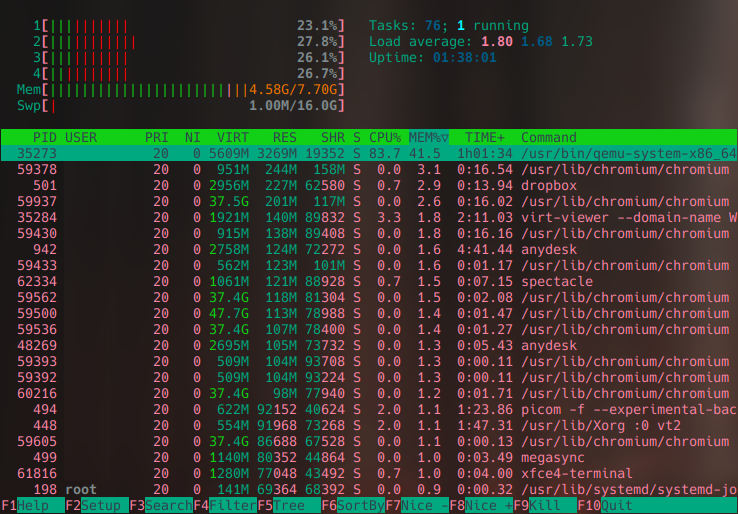
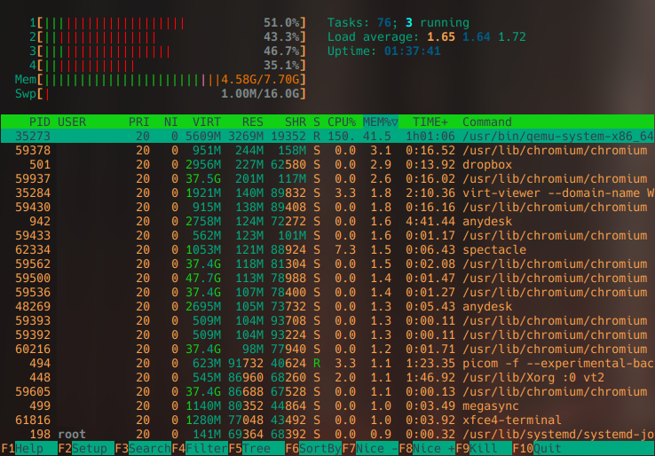
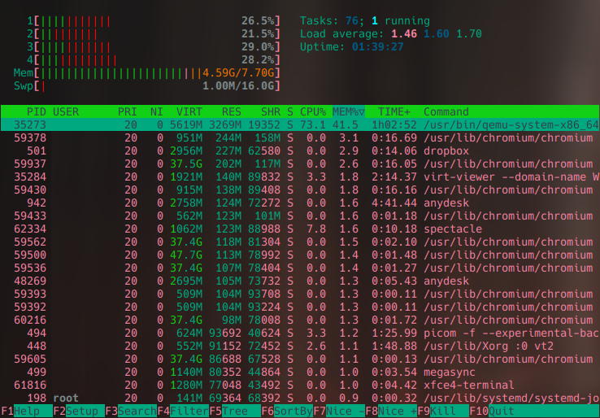
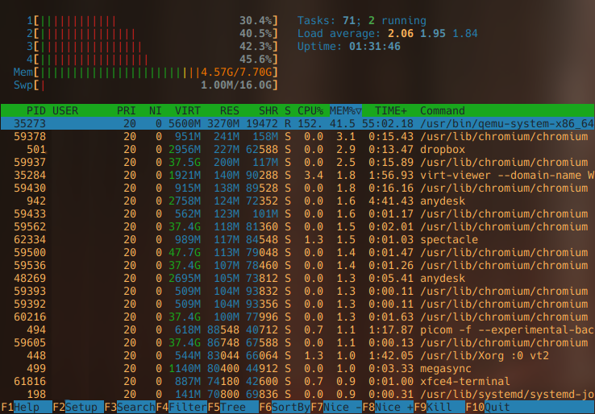

# XFCE4 Colorschemes

Colorschemes for the XFCE4 terminal emulator made in my taste. 

These colorschemes are open for anyone to download.

## Instalation
To use the colors you will need to have installed the xfce4 terminal emulator. 
To install the colorschemes you can run the following line of code:

`curl -fsSL https://raw.github.com/bornostojak/xfce4-terminal-colors/main/install.sh | sh`

It will generate the correct folder and copy all of the colorschemes into it.

## Bleak Montmogery Mod 

## Bleak Montmogery 

## Evo Grotanna 

## Evo Tokanna 

## Nova Altera 

## Stalker 

